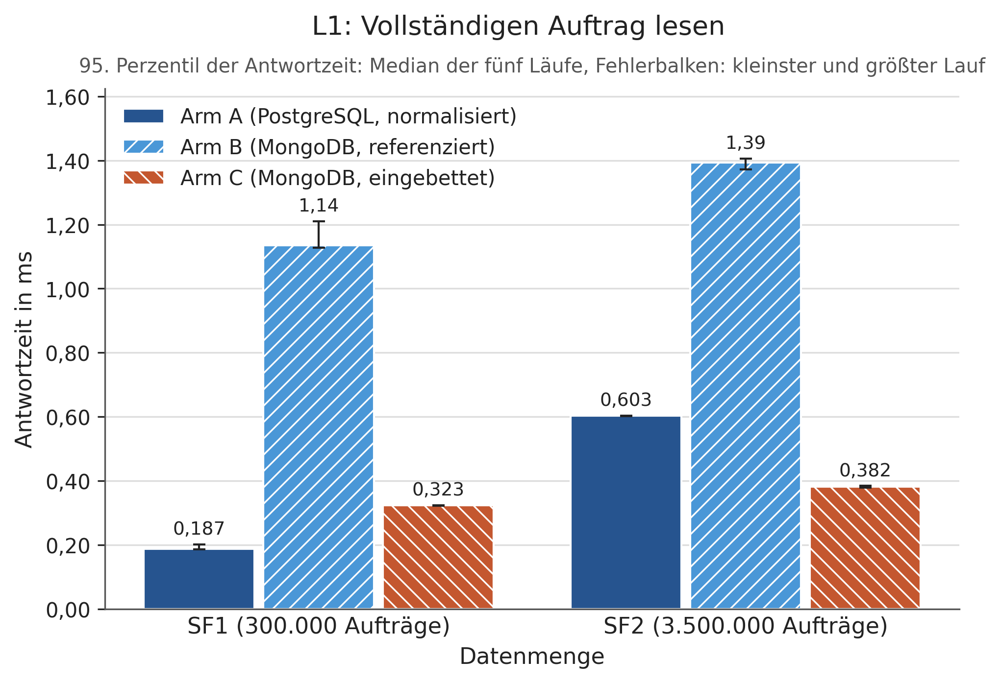
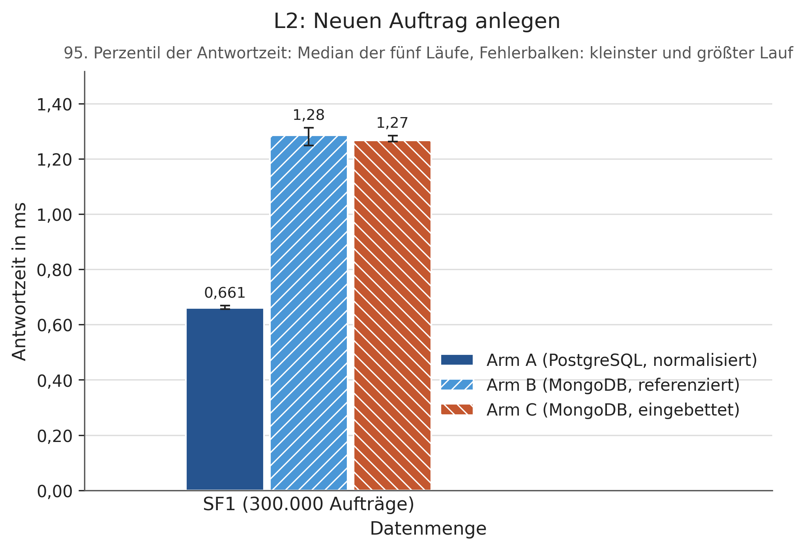
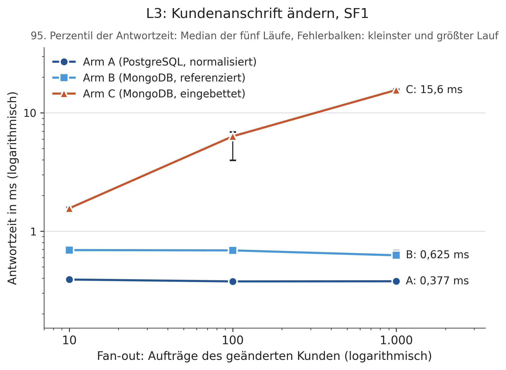
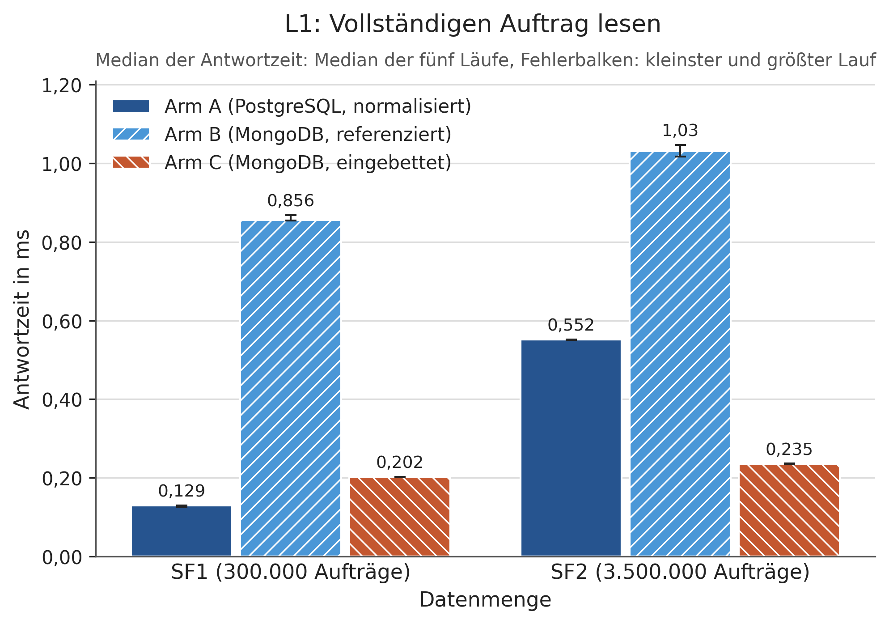
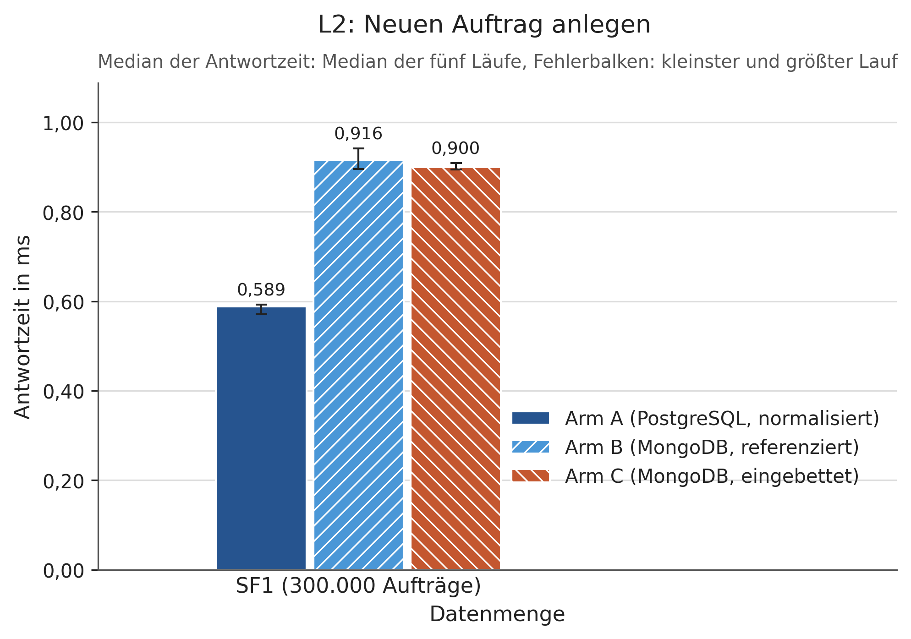
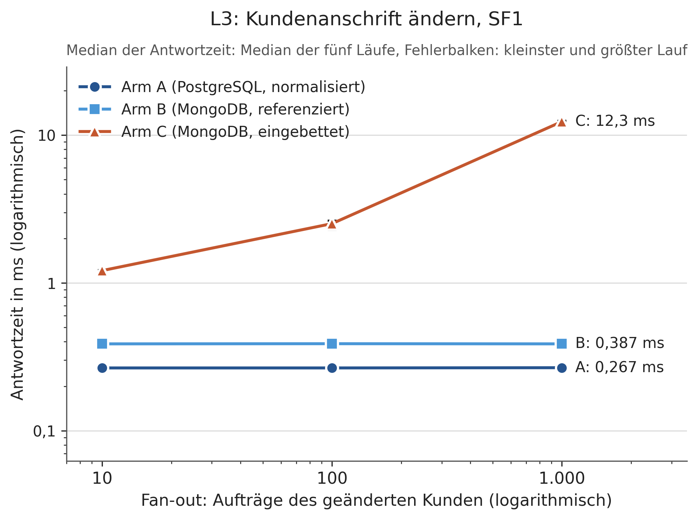
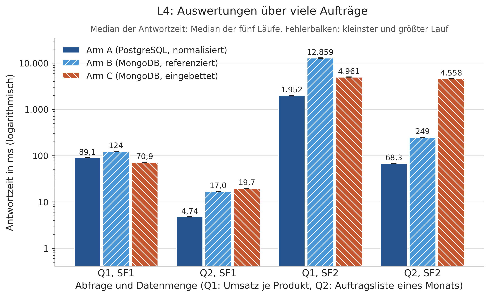
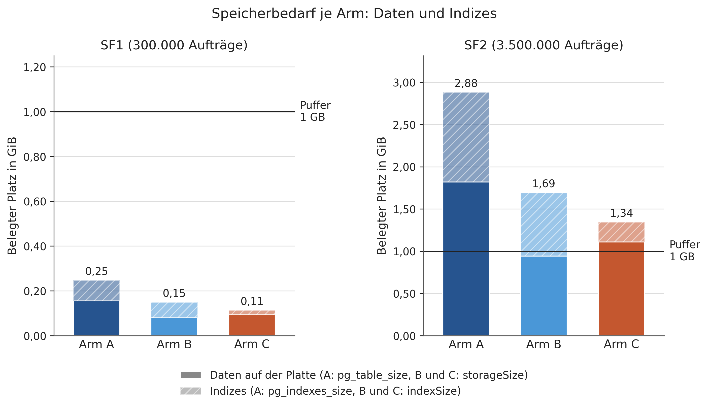

# Auswertung der Messreihe

Erzeugt von `skripte/auswertung.py` aus `ergebnisse/messungen.csv`, `ergebnisse/speicherbedarf_sf1.txt` und `ergebnisse/speicherbedarf_sf2.txt`. Der Bericht nennt Messwerte und die Urteile nach den vorab festgelegten Regeln, keine Deutung.

## 1. Datengrundlage und Vorprüfung

- Zeilen in `messungen.csv`: 150 (Soll 150): erfüllt
- Kombinationen aus Arm, Lastprofil, Datenmenge, Fan-out-Stufe und Abfrage: 30, je Kombination genau die Läufe 1 bis 5: erfüllt
- Zeilen mit Fehlern: 0: erfüllt
- Clients je Lauf: 4; Messdauer je Lauf: 120,0 bis 131,6 s
- Zeitraum der Läufe: 2026-10-01 22:58:47 bis 2026-10-02 10:31:39

## 2. Verdichtung je Kombination

Je Kombination der Median über die fünf Läufe, dazu kleinster und größter Lauf als Spannweite. Dateien: `tabelle_verdichtung.csv`, `tabelle_verdichtung.md`.

| Profil | Datenmenge | Fan-out | Arm | Median (ms) | Spannweite Median (ms) | 95. Perzentil (ms) | Spannweite 95. Perzentil (ms) | Durchsatz (Ops/s) | Spannweite Durchsatz (Ops/s) | Geschrieben je Operation |
|---|---|---|---|---|---|---|---|---|---|---|
| L1 | SF1 | – | A | 0,129 | 0,126 – 0,130 | 0,187 | 0,186 – 0,202 | 29.420,6 | 29.003,8 – 30.007,7 | – |
| L1 | SF1 | – | B | 0,856 | 0,854 – 0,868 | 1,135 | 1,128 – 1,210 | 4.532,5 | 4.437,2 – 4.547,5 | – |
| L1 | SF1 | – | C | 0,202 | 0,201 – 0,202 | 0,323 | 0,322 – 0,324 | 18.601,0 | 18.546,6 – 18.684,7 | – |
| L1 | SF2 | – | A | 0,552 | 0,551 – 0,552 | 0,603 | 0,602 – 0,603 | 7.198,7 | 7.196,7 – 7.209,4 | – |
| L1 | SF2 | – | B | 1,031 | 1,017 – 1,047 | 1,393 | 1,372 – 1,406 | 3.770,3 | 3.721,1 – 3.820,2 | – |
| L1 | SF2 | – | C | 0,235 | 0,234 – 0,236 | 0,382 | 0,378 – 0,384 | 15.936,1 | 15.886,7 – 16.040,3 | – |
| L2 | SF1 | – | A | 0,589 | 0,571 – 0,593 | 0,661 | 0,656 – 0,669 | 6.753,2 | 6.711,9 – 6.925,2 | 3,0 |
| L2 | SF1 | – | B | 0,916 | 0,896 – 0,942 | 1,285 | 1,248 – 1,313 | 4.240,6 | 4.145,8 – 4.341,9 | 3,0 |
| L2 | SF1 | – | C | 0,900 | 0,895 – 0,909 | 1,267 | 1,262 – 1,284 | 4.336,0 | 4.294,0 – 4.364,1 | 1,0 |
| L3 | SF1 | 10 | A | 0,266 | 0,263 – 0,271 | 0,390 | 0,374 – 0,402 | 14.361,2 | 14.195,3 – 14.597,4 | 1,0 |
| L3 | SF1 | 10 | B | 0,387 | 0,386 – 0,396 | 0,692 | 0,683 – 0,710 | 9.194,2 | 9.000,2 – 9.262,5 | 1,0 |
| L3 | SF1 | 10 | C | 1,212 | 1,203 – 1,222 | 1,560 | 1,546 – 1,588 | 3.199,2 | 3.163,4 – 3.219,7 | 11,0 |
| L3 | SF1 | 100 | A | 0,266 | 0,258 – 0,271 | 0,376 | 0,371 – 0,381 | 14.495,9 | 14.276,9 – 14.888,8 | 1,0 |
| L3 | SF1 | 100 | B | 0,388 | 0,382 – 0,395 | 0,688 | 0,674 – 0,703 | 9.229,1 | 9.040,8 – 9.357,0 | 1,0 |
| L3 | SF1 | 100 | C | 2,519 | 2,291 – 2,636 | 6,338 | 3,972 – 6,886 | 1.293,9 | 1.182,3 – 1.545,7 | 100,9 |
| L3 | SF1 | 1000 | A | 0,267 | 0,265 – 0,268 | 0,377 | 0,376 – 0,378 | 14.477,5 | 14.374,0 – 14.516,0 | 1,0 |
| L3 | SF1 | 1000 | B | 0,387 | 0,381 – 0,392 | 0,625 | 0,608 – 0,684 | 9.432,8 | 9.254,1 – 9.694,5 | 1,0 |
| L3 | SF1 | 1000 | C | 12,336 | 12,180 – 12,479 | 15,615 | 15,455 – 15,846 | 319,2 | 315,8 – 322,9 | 999,9 |
| L4-Q1 | SF1 | – | A | 89,057 | 88,730 – 89,577 | 102,136 | 98,717 – 102,419 | 48,3 | 48,2 – 48,4 | – |
| L4-Q1 | SF1 | – | B | 123,820 | 123,601 – 124,386 | 132,779 | 129,921 – 135,442 | 32,2 | 32,0 – 32,4 | – |
| L4-Q1 | SF1 | – | C | 70,923 | 70,714 – 72,347 | 73,866 | 73,567 – 75,588 | 56,5 | 55,3 – 56,6 | – |
| L4-Q1 | SF2 | – | A | 1.951,815 | 1.942,547 – 1.983,557 | 2.524,347 | 2.380,526 – 2.623,119 | 2,0 | 2,0 – 2,0 | – |
| L4-Q1 | SF2 | – | B | 12.858,878 | 12.677,333 – 12.899,240 | 13.710,950 | 13.333,823 – 14.378,607 | 0,3 | 0,3 – 0,3 | – |
| L4-Q1 | SF2 | – | C | 4.960,855 | 4.944,150 – 4.995,169 | 5.129,852 | 5.109,044 – 5.148,351 | 0,8 | 0,8 – 0,8 | – |
| L4-Q2 | SF1 | – | A | 4,739 | 4,733 – 4,750 | 4,998 | 4,994 – 5,007 | 840,8 | 838,8 – 841,6 | – |
| L4-Q2 | SF1 | – | B | 16,952 | 16,913 – 17,040 | 19,150 | 19,001 – 19,341 | 234,8 | 233,5 – 235,6 | – |
| L4-Q2 | SF1 | – | C | 19,681 | 19,661 – 19,756 | 21,781 | 21,630 – 21,879 | 202,5 | 201,7 – 202,8 | – |
| L4-Q2 | SF2 | – | A | 68,317 | 68,198 – 68,401 | 70,227 | 70,139 – 70,573 | 58,5 | 58,5 – 58,6 | – |
| L4-Q2 | SF2 | – | B | 249,033 | 246,628 – 250,157 | 262,317 | 259,446 – 264,324 | 16,1 | 16,0 – 16,2 | – |
| L4-Q2 | SF2 | – | C | 4.558,493 | 4.532,217 – 4.573,547 | 4.789,258 | 4.767,959 – 4.874,282 | 0,9 | 0,9 – 0,9 | – |

## 3. Effekte

Regel: Ein Unterschied gilt als Effekt, wenn er mindestens 10 % beträgt und sich die Spannweiten der fünf Läufe nicht überschneiden. Maßgeblich ist das 95. Perzentil; der Median wird zusätzlich berichtet. Faktor = größerer Wert geteilt durch kleineren Wert, Prozent = Abstand bezogen auf den kleineren (schnelleren) Wert. Dateien: `tabelle_effekte.csv`, `tabelle_effekte.md`.

| Kombination | Vergleich | 95. Perzentil (ms) | Faktor | Prozent | Urteil (95. Perzentil, maßgeblich) | Median (ms) | Faktor Median | Urteil (Median) | Urteile weichen ab |
|---|---|---|---|---|---|---|---|---|---|
| L1 SF1 | Modelleffekt: B gegen C | B 1,135 / C 0,323 | 3,51 | 251,4 | Effekt, C schneller | B 0,856 / C 0,202 | 4,24 | Effekt, C schneller | nein |
| L1 SF1 | Systemeffekt: A gegen B | A 0,187 / B 1,135 | 6,07 | 507,0 | Effekt, A schneller | A 0,129 / B 0,856 | 6,64 | Effekt, A schneller | nein |
| L1 SF1 | Gesamtunterschied: A gegen C | A 0,187 / C 0,323 | 1,73 | 72,7 | Effekt, A schneller | A 0,129 / C 0,202 | 1,57 | Effekt, A schneller | nein |
| L1 SF2 | Modelleffekt: B gegen C | B 1,393 / C 0,382 | 3,65 | 264,7 | Effekt, C schneller | B 1,031 / C 0,235 | 4,39 | Effekt, C schneller | nein |
| L1 SF2 | Systemeffekt: A gegen B | A 0,603 / B 1,393 | 2,31 | 131,0 | Effekt, A schneller | A 0,552 / B 1,031 | 1,87 | Effekt, A schneller | nein |
| L1 SF2 | Gesamtunterschied: A gegen C | A 0,603 / C 0,382 | 1,58 | 57,9 | Effekt, C schneller | A 0,552 / C 0,235 | 2,35 | Effekt, C schneller | nein |
| L2 SF1 | Modelleffekt: B gegen C | B 1,285 / C 1,267 | 1,01 | 1,4 | kein Effekt (unter 10 %, Spannweiten überschneiden sich) | B 0,916 / C 0,900 | 1,02 | kein Effekt (unter 10 %, Spannweiten überschneiden sich) | nein |
| L2 SF1 | Systemeffekt: A gegen B | A 0,661 / B 1,285 | 1,94 | 94,4 | Effekt, A schneller | A 0,589 / B 0,916 | 1,56 | Effekt, A schneller | nein |
| L2 SF1 | Gesamtunterschied: A gegen C | A 0,661 / C 1,267 | 1,92 | 91,7 | Effekt, A schneller | A 0,589 / C 0,900 | 1,53 | Effekt, A schneller | nein |
| L3 SF1 Fan-out 10 | Modelleffekt: B gegen C | B 0,692 / C 1,560 | 2,25 | 125,4 | Effekt, B schneller | B 0,387 / C 1,212 | 3,13 | Effekt, B schneller | nein |
| L3 SF1 Fan-out 10 | Systemeffekt: A gegen B | A 0,390 / B 0,692 | 1,77 | 77,4 | Effekt, A schneller | A 0,266 / B 0,387 | 1,45 | Effekt, A schneller | nein |
| L3 SF1 Fan-out 10 | Gesamtunterschied: A gegen C | A 0,390 / C 1,560 | 4,00 | 300,0 | Effekt, A schneller | A 0,266 / C 1,212 | 4,56 | Effekt, A schneller | nein |
| L3 SF1 Fan-out 100 | Modelleffekt: B gegen C | B 0,688 / C 6,338 | 9,21 | 821,2 | Effekt, B schneller | B 0,388 / C 2,519 | 6,49 | Effekt, B schneller | nein |
| L3 SF1 Fan-out 100 | Systemeffekt: A gegen B | A 0,376 / B 0,688 | 1,83 | 83,0 | Effekt, A schneller | A 0,266 / B 0,388 | 1,46 | Effekt, A schneller | nein |
| L3 SF1 Fan-out 100 | Gesamtunterschied: A gegen C | A 0,376 / C 6,338 | 16,86 | 1.585,6 | Effekt, A schneller | A 0,266 / C 2,519 | 9,47 | Effekt, A schneller | nein |
| L3 SF1 Fan-out 1000 | Modelleffekt: B gegen C | B 0,625 / C 15,615 | 24,98 | 2.398,4 | Effekt, B schneller | B 0,387 / C 12,336 | 31,88 | Effekt, B schneller | nein |
| L3 SF1 Fan-out 1000 | Systemeffekt: A gegen B | A 0,377 / B 0,625 | 1,66 | 65,8 | Effekt, A schneller | A 0,267 / B 0,387 | 1,45 | Effekt, A schneller | nein |
| L3 SF1 Fan-out 1000 | Gesamtunterschied: A gegen C | A 0,377 / C 15,615 | 41,42 | 4.041,9 | Effekt, A schneller | A 0,267 / C 12,336 | 46,20 | Effekt, A schneller | nein |
| L4-Q1 SF1 | Modelleffekt: B gegen C | B 132,779 / C 73,866 | 1,80 | 79,8 | Effekt, C schneller | B 123,820 / C 70,923 | 1,75 | Effekt, C schneller | nein |
| L4-Q1 SF1 | Systemeffekt: A gegen B | A 102,136 / B 132,779 | 1,30 | 30,0 | Effekt, A schneller | A 89,057 / B 123,820 | 1,39 | Effekt, A schneller | nein |
| L4-Q1 SF1 | Gesamtunterschied: A gegen C | A 102,136 / C 73,866 | 1,38 | 38,3 | Effekt, C schneller | A 89,057 / C 70,923 | 1,26 | Effekt, C schneller | nein |
| L4-Q1 SF2 | Modelleffekt: B gegen C | B 13.710,950 / C 5.129,852 | 2,67 | 167,3 | Effekt, C schneller | B 12.858,878 / C 4.960,855 | 2,59 | Effekt, C schneller | nein |
| L4-Q1 SF2 | Systemeffekt: A gegen B | A 2.524,347 / B 13.710,950 | 5,43 | 443,1 | Effekt, A schneller | A 1.951,815 / B 12.858,878 | 6,59 | Effekt, A schneller | nein |
| L4-Q1 SF2 | Gesamtunterschied: A gegen C | A 2.524,347 / C 5.129,852 | 2,03 | 103,2 | Effekt, A schneller | A 1.951,815 / C 4.960,855 | 2,54 | Effekt, A schneller | nein |
| L4-Q2 SF1 | Modelleffekt: B gegen C | B 19,150 / C 21,781 | 1,14 | 13,7 | Effekt, B schneller | B 16,952 / C 19,681 | 1,16 | Effekt, B schneller | nein |
| L4-Q2 SF1 | Systemeffekt: A gegen B | A 4,998 / B 19,150 | 3,83 | 283,2 | Effekt, A schneller | A 4,739 / B 16,952 | 3,58 | Effekt, A schneller | nein |
| L4-Q2 SF1 | Gesamtunterschied: A gegen C | A 4,998 / C 21,781 | 4,36 | 335,8 | Effekt, A schneller | A 4,739 / C 19,681 | 4,15 | Effekt, A schneller | nein |
| L4-Q2 SF2 | Modelleffekt: B gegen C | B 262,317 / C 4.789,258 | 18,26 | 1.725,8 | Effekt, B schneller | B 249,033 / C 4.558,493 | 18,30 | Effekt, B schneller | nein |
| L4-Q2 SF2 | Systemeffekt: A gegen B | A 70,227 / B 262,317 | 3,74 | 273,5 | Effekt, A schneller | A 68,317 / B 249,033 | 3,65 | Effekt, A schneller | nein |
| L4-Q2 SF2 | Gesamtunterschied: A gegen C | A 70,227 / C 4.789,258 | 68,20 | 6.719,7 | Effekt, A schneller | A 68,317 / C 4.558,493 | 66,73 | Effekt, A schneller | nein |

Vergleiche, in denen 95. Perzentil und Median zu unterschiedlichen Urteilen führen: 0 von 30.

## 4. Hypothesen

### H1

Regel: H1 ist bestätigt, wenn C in L1 schneller ist als B (Effekt) und in L4 nicht schneller als B. „Nicht schneller“ heißt hier: Es liegt kein Effekt zugunsten von C vor. Geprüft je Datenmenge und je Abfrage. Dateien: `tabelle_h1.csv`, `tabelle_h1.md`.

| Kennzahl | Datenmenge | Teilbedingung | B (ms) | C (ms) | Befund | erfüllt |
|---|---|---|---|---|---|---|
| 95. Perzentil (maßgeblich) | SF1 | L1: C schneller als B (Effekt) | 1,135 | 0,323 | Effekt, C schneller | ja |
| 95. Perzentil (maßgeblich) | SF1 | L4-Q1: C nicht schneller als B | 132,779 | 73,866 | Effekt, C schneller | nein |
| 95. Perzentil (maßgeblich) | SF1 | L4-Q2: C nicht schneller als B | 19,150 | 21,781 | Effekt, B schneller | ja |
| 95. Perzentil (maßgeblich) | SF1 | Gesamturteil (alle Teilbedingungen) |  |  | nicht bestätigt | nein |
| 95. Perzentil (maßgeblich) | SF2 | L1: C schneller als B (Effekt) | 1,393 | 0,382 | Effekt, C schneller | ja |
| 95. Perzentil (maßgeblich) | SF2 | L4-Q1: C nicht schneller als B | 13.710,950 | 5.129,852 | Effekt, C schneller | nein |
| 95. Perzentil (maßgeblich) | SF2 | L4-Q2: C nicht schneller als B | 262,317 | 4.789,258 | Effekt, B schneller | ja |
| 95. Perzentil (maßgeblich) | SF2 | Gesamturteil (alle Teilbedingungen) |  |  | nicht bestätigt | nein |
| Median | SF1 | L1: C schneller als B (Effekt) | 0,856 | 0,202 | Effekt, C schneller | ja |
| Median | SF1 | L4-Q1: C nicht schneller als B | 123,820 | 70,923 | Effekt, C schneller | nein |
| Median | SF1 | L4-Q2: C nicht schneller als B | 16,952 | 19,681 | Effekt, B schneller | ja |
| Median | SF1 | Gesamturteil (alle Teilbedingungen) |  |  | nicht bestätigt | nein |
| Median | SF2 | L1: C schneller als B (Effekt) | 1,031 | 0,235 | Effekt, C schneller | ja |
| Median | SF2 | L4-Q1: C nicht schneller als B | 12.858,878 | 4.960,855 | Effekt, C schneller | nein |
| Median | SF2 | L4-Q2: C nicht schneller als B | 249,033 | 4.558,493 | Effekt, B schneller | ja |
| Median | SF2 | Gesamturteil (alle Teilbedingungen) |  |  | nicht bestätigt | nein |

Urteil nach der maßgeblichen Kennzahl (95. Perzentil): SF1 nicht bestätigt, SF2 nicht bestätigt.

Teilbedingungen, die 95. Perzentil und Median unterschiedlich beurteilen: 0.

### H2

Regel: H2 ist bestätigt, wenn die Antwortzeit von C in L3 von Fan-out 10 zu 100 und von 100 zu 1000 jeweils um einen Effekt steigt, während A und B über alle drei Stufen innerhalb von 10 % bleiben (größter gegen kleinsten Wert der drei Stufen). Dateien: `tabelle_h2.csv`, `tabelle_h2.md`.

| Kennzahl | Teilbedingung | Werte (ms) | Kennwert | Befund | erfüllt |
|---|---|---|---|---|---|
| 95. Perzentil (maßgeblich) | C: Anstieg von Fan-out 10 zu 100 (Effekt) | 1,560 → 6,338 | Faktor 4,06 | Effekt, Anstieg | ja |
| 95. Perzentil (maßgeblich) | C: Anstieg von Fan-out 100 zu 1000 (Effekt) | 6,338 → 15,615 | Faktor 2,46 | Effekt, Anstieg | ja |
| 95. Perzentil (maßgeblich) | A: über alle drei Stufen innerhalb von 10 % | 0,390 / 0,376 / 0,377 | Abstand 3,7 % | innerhalb von 10 % | ja |
| 95. Perzentil (maßgeblich) | B: über alle drei Stufen innerhalb von 10 % | 0,692 / 0,688 / 0,625 | Abstand 10,7 % | außerhalb von 10 % | nein |
| 95. Perzentil (maßgeblich) | Gesamturteil (alle Teilbedingungen) |  |  | nicht bestätigt | nein |
| Median | C: Anstieg von Fan-out 10 zu 100 (Effekt) | 1,212 → 2,519 | Faktor 2,08 | Effekt, Anstieg | ja |
| Median | C: Anstieg von Fan-out 100 zu 1000 (Effekt) | 2,519 → 12,336 | Faktor 4,90 | Effekt, Anstieg | ja |
| Median | A: über alle drei Stufen innerhalb von 10 % | 0,266 / 0,266 / 0,267 | Abstand 0,4 % | innerhalb von 10 % | ja |
| Median | B: über alle drei Stufen innerhalb von 10 % | 0,387 / 0,388 / 0,387 | Abstand 0,3 % | innerhalb von 10 % | ja |
| Median | Gesamturteil (alle Teilbedingungen) |  |  | bestätigt | ja |

Urteil nach der maßgeblichen Kennzahl (95. Perzentil): nicht bestätigt.

Teilbedingungen, die 95. Perzentil und Median unterschiedlich beurteilen: 2.
- B: über alle drei Stufen innerhalb von 10 %: 95. Perzentil nicht erfüllt, Median erfüllt
- Gesamturteil (alle Teilbedingungen): 95. Perzentil nicht erfüllt, Median erfüllt

## 5. Schwellenwert

Mindestzahl Lesezugriffe je Änderung = (Änderungszeit C − Änderungszeit Vergleichsarm) / (Lesezeit Vergleichsarm − Lesezeit C), mit den Medianen aus L3 (SF1) und L1. Liegt das Verhältnis von Lese- zu Änderungszugriffen einer Anwendung über dem Wert, ist die Einbettung im Vorteil. Die Zeilen mit Lesezeiten aus SF2 sind gemischt: L3 wurde nur auf SF1 gemessen. Dateien: `tabelle_schwellenwert.csv`, `tabelle_schwellenwert.md`.

| Lesezeiten aus | C gegen | Fan-out | Änderungszeit C (ms) | Änderungszeit Vergleichsarm (ms) | Lesezeit Vergleichsarm (ms) | Lesezeit C (ms) | Mindestzahl Lesezugriffe je Änderung |
|---|---|---|---|---|---|---|---|
| SF1 | B | 10 | 1,212 | 0,387 | 0,856 | 0,202 | 1,26 |
| SF1 | B | 100 | 2,519 | 0,388 | 0,856 | 0,202 | 3,26 |
| SF1 | B | 1000 | 12,336 | 0,387 | 0,856 | 0,202 | 18,27 |
| SF1 | A | 10 | 1,212 | 0,266 | 0,129 | 0,202 | kein Schwellenwert: C liest nicht schneller als A (Lesezeit A 0,129 ms, C 0,202 ms) |
| SF1 | A | 100 | 2,519 | 0,266 | 0,129 | 0,202 | kein Schwellenwert: C liest nicht schneller als A (Lesezeit A 0,129 ms, C 0,202 ms) |
| SF1 | A | 1000 | 12,336 | 0,267 | 0,129 | 0,202 | kein Schwellenwert: C liest nicht schneller als A (Lesezeit A 0,129 ms, C 0,202 ms) |
| SF2 (gemischt mit L3 aus SF1) | B | 10 | 1,212 | 0,387 | 1,031 | 0,235 | 1,04 |
| SF2 (gemischt mit L3 aus SF1) | B | 100 | 2,519 | 0,388 | 1,031 | 0,235 | 2,68 |
| SF2 (gemischt mit L3 aus SF1) | B | 1000 | 12,336 | 0,387 | 1,031 | 0,235 | 15,01 |
| SF2 (gemischt mit L3 aus SF1) | A | 10 | 1,212 | 0,266 | 0,552 | 0,235 | 2,98 |
| SF2 (gemischt mit L3 aus SF1) | A | 100 | 2,519 | 0,266 | 0,552 | 0,235 | 7,11 |
| SF2 (gemischt mit L3 aus SF1) | A | 1000 | 12,336 | 0,267 | 0,552 | 0,235 | 38,07 |

## 6. Speicherbedarf

Die Kennzahlen sind je System verschieden. PostgreSQL hat keine Entsprechung zu dataSize und storageSize; vergleichbar über alle drei Arme ist der Gesamtbedarf aus Daten und Indizes. MB = 10^6 Bytes; das Verhältnis zum Puffer bezieht den Gesamtbedarf auf 1 GB = 2^30 Bytes. Dateien: `tabelle_speicher.csv`, `tabelle_speicher.md`.

| Datenmenge | Arm | Daten auf der Platte (MB) | Daten unkomprimiert (MB) | Indizes (MB) | Gesamtbedarf Daten + Indizes (MB) | Verhältnis zum Puffer (1 GB) | pg_database_size (MB) |
|---|---|---|---|---|---|---|---|
| SF1 | A | 167,6 (pg_table_size) | – (keine Entsprechung) | 98,1 (pg_indexes_size) | 265,6 (pg_total_relation_size) | 0,25 | 274,0 |
| SF1 | B | 86,5 (storageSize) | 296,2 (dataSize) | 73,3 (indexSize) | 159,9 (totalSize) | 0,15 | – |
| SF1 | C | 101,0 (storageSize) | 373,1 (dataSize) | 20,6 (indexSize) | 121,6 (totalSize) | 0,11 | – |
| SF2 | A | 1.952,8 (pg_table_size) | – (keine Entsprechung) | 1.142,3 (pg_indexes_size) | 3.095,2 (pg_total_relation_size) | 2,88 | 3.103,6 |
| SF2 | B | 1.013,6 (storageSize) | 3.459,3 (dataSize) | 804,0 (indexSize) | 1.817,6 (totalSize) | 1,69 | – |
| SF2 | C | 1.190,2 (storageSize) | 4.360,3 (dataSize) | 253,2 (indexSize) | 1.443,4 (totalSize) | 1,34 | – |

## 7. Abbildungen

Jede Abbildung liegt als PNG (300 dpi) und als PDF vor. Balken und Punkte zeigen den Median der fünf Läufe, Fehlerbalken den kleinsten und größten Lauf. Die Abbildungen zu L1 bis L4 gibt es für das 95. Perzentil (maßgeblich) und für den Median.

**L1, vollständigen Auftrag lesen (95. Perzentil)** (`abb_l1_p95.png`, `abb_l1_p95.pdf`)

**L2, neuen Auftrag anlegen (95. Perzentil)** (`abb_l2_p95.png`, `abb_l2_p95.pdf`)

**L3, Kundenanschrift ändern über die Fan-out-Stufen (95. Perzentil)** (`abb_l3_p95.png`, `abb_l3_p95.pdf`)

**L4, Auswertungen Q1 und Q2 (95. Perzentil)** (`abb_l4_p95.png`, `abb_l4_p95.pdf`)

**L1, vollständigen Auftrag lesen (Median)** (`abb_l1_median.png`, `abb_l1_median.pdf`)

**L2, neuen Auftrag anlegen (Median)** (`abb_l2_median.png`, `abb_l2_median.pdf`)

**L3, Kundenanschrift ändern über die Fan-out-Stufen (Median)** (`abb_l3_median.png`, `abb_l3_median.pdf`)

**L4, Auswertungen Q1 und Q2 (Median)** (`abb_l4_median.png`, `abb_l4_median.pdf`)

**Speicherbedarf je Arm und Datenmenge** (`abb_speicherbedarf.png`, `abb_speicherbedarf.pdf`)

